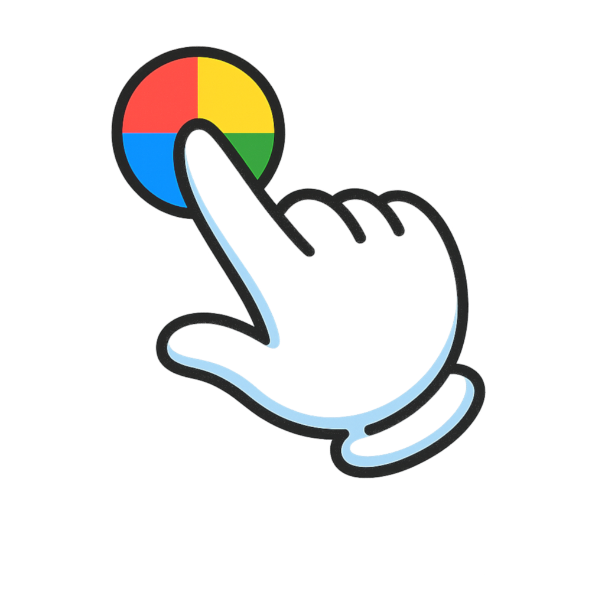

# ChromaTap (Alpha v0.1.0)

A powerful color sampling and palette management tool for Windows. Sample colors from anywhere on your screen, create palettes, use an interactive color wheel, and save your work locally.

## 🎨 Features

- **🎯 Color Sampling**: Click and hold to sample any color from your screen in real-time
- **🎡 Interactive Color Wheel**: Visual HSV color picker with brightness and saturation controls
- **🔄 Color Invert**: Generate complementary colors instantly
- **🎨 Palette Management**: Create, save, and organize color palettes
- **📋 Drag & Drop**: Drag colors from the sampler to any palette
- **💾 Auto-Save**: Palettes persist across sessions
- **📊 Multiple Formats**: View colors in HEX, RGB, and CMYK
- **✏️ Editable**: Rename palettes, remove colors, duplicate entire palettes

## 📥 Installation (Alpha Build)

### Download
1. Go to [Releases](https://github.com/yourusername/ChromaTap/releases)
2. Download `ChromaTap-0.1.0-alpha-Setup.exe` for Windows

### Install
1. Run the downloaded `.exe` file
2. Follow the installation wizard
3. Launch ChromaTap from your Start Menu or Desktop shortcut

## 🚀 Usage

### Sampling Colors
1. Click **"🎯 Sample Color"** button
2. Move your cursor anywhere on screen (over any application)
3. Watch the **Live Preview** update in real-time
4. Release to capture the color to **Selected Color**

### Using the Color Wheel
1. Click anywhere on the color wheel to select a color
2. Adjust **Brightness** and **Saturation** sliders
3. Click **"🔄 Invert Color"** to get the complementary color

### Creating Palettes
1. Click **"🎨 Create Palette"**
2. Name your palette
3. Drag colors from "Selected Color" into the palette
4. Click **"💾 Save"** to persist your palette
5. Click **"📋 Copy"** to duplicate the entire palette

### Managing Colors
- Click any swatch in a palette to reload it to Selected Color and Color Wheel
- Click the **×** on a swatch to remove it
- Change palette names by editing the text field
- Unsaved changes show an orange border

## ⚙️ Technical Details

- **Platform**: Windows (64-bit)
- **Built with**: Electron, Node.js
- **Storage**: Local JSON files in user data directory
- **Color Sampling**: RobotJS for screen pixel capture

## 🐛 Known Issues (Alpha)

- Color wheel preview box only follows cursor within the app window
- Large file size (~50-100MB) due to RobotJS dependencies
- Windows only (Mac/Linux support planned)

## 🔮 Roadmap

- [ ] AWS Lambda AI integration for smart color naming
- [ ] AI-powered color recommendations
- [ ] Cloud backup for palettes
- [ ] Export palettes to various formats (Adobe, CSS, etc.)
- [ ] Multi-project management UI
- [ ] Cross-platform support (Mac/Linux)

## 📝 Feedback

This is an **alpha release** for testing. Please report bugs or feature requests via [GitHub Issues](https://github.com/yourusername/ChromaTap/issues).

## 📄 License

MIT License - See LICENSE file for details

---

**Version**: 0.1.0-alpha  
**Author**: Ryan  
**Last Updated**: October 30, 2025
